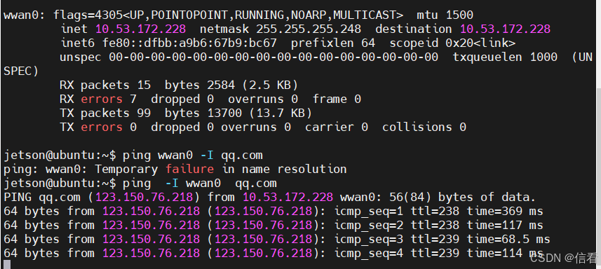
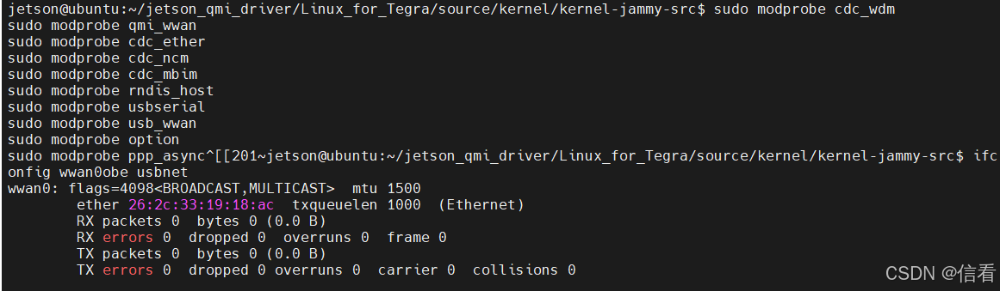
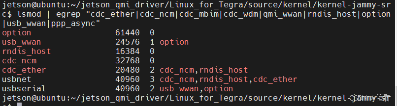
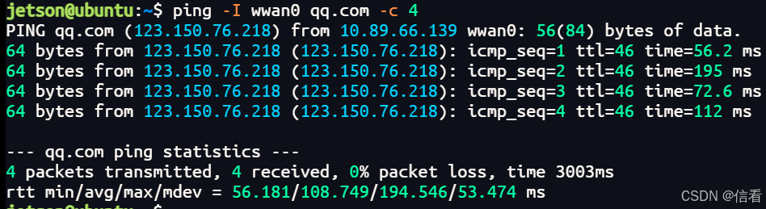
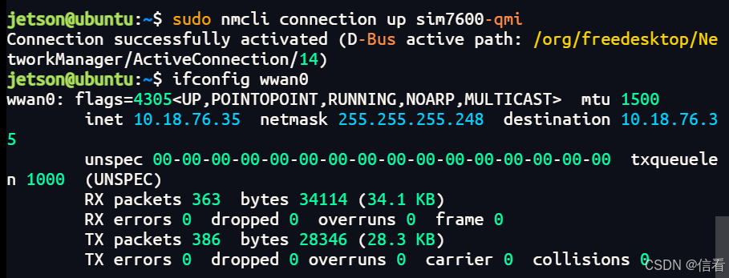

# Jetson Orin Quectel SIMCOM Qualcomm Module QMI Dial-up Guide

Original article: <https://blog.csdn.net/qq_43231904/article/details/161805938>

License note: the original article is marked as CC 4.0 BY-SA. This file is an English Markdown version for archiving and GitHub upload.

> After QMI dial-up succeeds, the `wwan0` network interface appears and receives an IP address assigned by the carrier.



## Get the Source Code

You can also cross-compile the driver on another machine, but the source code must match the kernel version of the target board.

Install build dependencies:

```bash
sudo apt install -y build-essential bc bison flex libssl-dev libelf-dev dwarves \
kmod wget tar xz-utils zstd libncurses-dev

mkdir -p ~/jetson_qmi_driver
cd ~/jetson_qmi_driver
```

Download the kernel source code for the matching version:

```bash
jetson@ubuntu:~/jetson_qmi_driver$ cat /etc/nv_tegra_release

# R36 (release), REVISION: 5.0, GCID: 43688277, BOARD: generic, EABI: aarch64, DATE: Fri Jan 16 03:50:45 UTC 2026
# KERNEL_VARIANT: oot
TARGET_USERSPACE_LIB_DIR=nvidia
TARGET_USERSPACE_LIB_DIR_PATH=usr/lib/aarch64-linux-gnu/nvidia

jetson@ubuntu:~/jetson_qmi_driver$ uname -a
Linux ubuntu 5.15.185-tegra #1 SMP PREEMPT Thu Jan 15 19:24:38 PST 2026 aarch64 aarch64 aarch64 GNU/Linux
```

```bash
wget -c -O public_sources.tbz2 https://developer.nvidia.com/downloads/embedded/l4t/r36_release_v5.0/sources/public_sources.tbz2
```

You can also use a `source.sh` script to download it automatically:

```bash
L4T_MAJOR=$(grep -oP 'R\d+' /etc/nv_tegra_release | head -1 | tr -d 'R')    # 36
L4T_MINOR=$(grep -oP 'REVISION:\s*\K[\d.]+' /etc/nv_tegra_release)           # 5.0

echo "L4T: R${L4T_MAJOR} v${L4T_MINOR}"
URL="https://developer.download.nvidia.com/embedded/L4T/r${L4T_MAJOR}_Release_v${L4T_MINOR}/sources/public_sources.tbz2"
echo "Download: $URL"

wget -O public_sources.tbz2 "$URL" || {
    echo "Download failed, trying backup URL..."
    wget -O public_sources.tbz2 "https://developer.download.nvidia.cn/embedded/L4T/r${L4T_MAJOR}_Release_v${L4T_MINOR}/sources/public_sources.tbz2"
}
```

Windows download link:

```text
https://developer.download.nvidia.com/embedded/L4T/r36_Release_v5.0/sources/public_sources.tbz2
```

## Compile the `.ko` Driver Files

If you need to reset the process, unload the drivers and return to this step:

```bash
# 1. Disconnect the current connection
sudo qmi-network /dev/cdc-wdm0 stop
sudo ip link set wwan0 down

# 2. Unload kernel modules in reverse order
sudo rmmod option 2>/dev/null
sudo rmmod usb_wwan 2>/dev/null
sudo rmmod qmi_wwan 2>/dev/null
sudo rmmod cdc_wdm 2>/dev/null
sudo rmmod usbnet 2>/dev/null

# 3. Clear the QMI state file
sudo rm -f /tmp/qmi-network-state-cdc-wdm0

# 4. Confirm the environment is clean
lsmod | grep -E "qmi_wwan|cdc_wdm|option"  # Expected: no output
ls /dev/cdc-wdm0  # Expected: file does not exist

# 5. Optional: remove installed modules
sudo rm -rf /lib/modules/$(uname -r)/extra/qmi/
sudo depmod -a
```

Extract the package:

```bash
tar -xvjf public_sources.tbz2
```

Find `kernel_src.tbz2`:

```bash
find ~/jetson_qmi_driver -name kernel_src.tbz2

cd ~/jetson_qmi_driver/Linux_for_Tegra/source
```

Extract the kernel source:

```bash
tar -xvjf kernel_src.tbz2
```

Enter the kernel source directory:

```bash
cd kernel/kernel-jammy-src
```

Copy the current system configuration:

```bash
zcat /proc/config.gz > .config
```

If `/proc/config.gz` is not available, use:

```bash
cp /boot/config-$(uname -r) .config
```

Enable the required drivers as modules. Command-line configuration is more convenient than the menu interface:

```bash
./scripts/config --module USB_USBNET
./scripts/config --module USB_NET_QMI_WWAN
./scripts/config --module USB_WDM
./scripts/config --module USB_NET_CDCETHER
./scripts/config --module USB_NET_CDC_NCM
./scripts/config --module USB_NET_CDC_MBIM
./scripts/config --module USB_NET_RNDIS_HOST
./scripts/config --module USB_SERIAL
./scripts/config --module USB_SERIAL_WWAN
./scripts/config --module USB_SERIAL_OPTION
./scripts/config --module PPP
./scripts/config --module PPP_ASYNC
./scripts/config --module PPP_SYNC_TTY
./scripts/config --module SLHC
./scripts/config --set-str LOCALVERSION "-tegra"
```

Generate the configuration and prepare the build:

```bash
make olddefconfig
make prepare
make modules_prepare
```

Compile the USB network drivers, including `qmi_wwan`, `cdc_mbim`, `rndis_host`, and `usbnet`:

```bash
make -j$(nproc) M=drivers/net/usb modules
```

Compile `cdc-wdm`, the control channel for QMI and MBIM:

```bash
make -j$(nproc) M=drivers/usb/class modules
```

Compile the USB serial drivers for `ttyUSB*` ports:

```bash
make -j$(nproc) M=drivers/usb/serial modules
```

Compile PPP drivers, if needed:

```bash
make -j$(nproc) M=drivers/net/ppp modules
```

Create the installation directory:

```bash
sudo mkdir -p /lib/modules/$(uname -r)/extra/qmi
```

You can also compile with a Makefile:

```bash
cd kernel/kernel-jammy-src
zcat /proc/config.gz > .config

cp /path/to/Makefile.qmi Makefile

make MODE=qmi       # QMI mode
make MODE=rndis     # RNDIS mode
make MODE=mbim      # MBIM mode
make MODE=ecm       # ECM mode
make MODE=all       # Build all

sudo make install   # One-step installation
```

Copy the `.ko` files:

```bash
sudo cp -f drivers/net/usb/usbnet.ko /lib/modules/$(uname -r)/extra/qmi/ 2>/dev/null || true
sudo cp -f drivers/net/usb/qmi_wwan.ko /lib/modules/$(uname -r)/extra/qmi/ 2>/dev/null || true
sudo cp -f drivers/net/usb/cdc_ether.ko /lib/modules/$(uname -r)/extra/qmi/ 2>/dev/null || true
sudo cp -f drivers/net/usb/cdc_ncm.ko /lib/modules/$(uname -r)/extra/qmi/ 2>/dev/null || true
sudo cp -f drivers/net/usb/cdc_mbim.ko /lib/modules/$(uname -r)/extra/qmi/ 2>/dev/null || true
sudo cp -f drivers/net/usb/rndis_host.ko /lib/modules/$(uname -r)/extra/qmi/ 2>/dev/null || true
sudo cp -f drivers/usb/class/cdc-wdm.ko /lib/modules/$(uname -r)/extra/qmi/ 2>/dev/null || true
sudo cp -f drivers/usb/serial/usbserial.ko /lib/modules/$(uname -r)/extra/qmi/ 2>/dev/null || true
sudo cp -f drivers/usb/serial/usb_wwan.ko /lib/modules/$(uname -r)/extra/qmi/ 2>/dev/null || true
sudo cp -f drivers/usb/serial/option.ko /lib/modules/$(uname -r)/extra/qmi/ 2>/dev/null || true
sudo cp -f drivers/net/ppp/ppp_generic.ko /lib/modules/$(uname -r)/extra/qmi/ 2>/dev/null || true
sudo cp -f drivers/net/ppp/ppp_async.ko /lib/modules/$(uname -r)/extra/qmi/ 2>/dev/null || true
sudo cp -f drivers/net/ppp/ppp_synctty.ko /lib/modules/$(uname -r)/extra/qmi/ 2>/dev/null || true
sudo cp -f drivers/net/ppp/slhc.ko /lib/modules/$(uname -r)/extra/qmi/ 2>/dev/null || true
```

Refresh module dependencies:

```bash
sudo depmod -a
```

## Load the Drivers into the Kernel

If the kernel already includes the drivers, you can start from this step.

Load only the drivers required for the selected mode. The example below uses QMI dial-up and loads `qmi_wwan`. Avoid loading multiple network drivers at the same time to prevent network interface conflicts. To unload a driver, use `sudo rmmod xxx`.

```bash
sudo modprobe usbnet
sudo modprobe cdc_wdm
sudo modprobe qmi_wwan
sudo modprobe cdc_ether
# sudo modprobe cdc_ncm
# sudo modprobe cdc_mbim
# sudo modprobe rndis_host
sudo modprobe usbserial
sudo modprobe usb_wwan
sudo modprobe option
# sudo modprobe ppp_async
```

At this point, the `wwan0` network interface should be available.



Check whether the drivers are loaded:

```bash
lsmod | egrep "cdc_ether|cdc_ncm|cdc_mbim|cdc_wdm|qmi_wwan|rndis_host|option|usb_wwan|ppp_async"
```



Check the `.ko` version:

```bash
modinfo qmi_wwan | grep vermagic
modinfo cdc_wdm | grep vermagic
modinfo option | grep vermagic
uname -r
```

They must all match:

```text
5.15.185-tegra
```

After inserting the module, check the device:

```bash
lsusb
dmesg | grep -iE "qmi|cdc-wdm|wwan|ttyUSB|option|2c7c" | tail -80
ls /dev/cdc-wdm*
ls /dev/ttyUSB*
ip -br link | grep -E "wwan|usb|enx"
```

## Start QMI Dial-up

### Option 1: QMI Tool Dial-up

Recommended for Raspberry Pi and RM520.

Install the QMI tools:

```bash
sudo apt install -y libqmi-utils udhcpc isc-dhcp-client
```

Create the QMI configuration:

```bash
sudo tee /etc/qmi-network.conf >/dev/null <<'EOF'
APN=CMNET
APN_USER=
APN_PASS=
APN_AUTH=none
IP_TYPE=4
PROXY=yes
EOF
```

Stop services that may take over the modem:

```bash
sudo systemctl stop ModemManager 2>/dev/null || true
sudo killall ModemManager 2>/dev/null || true
```

Set `raw-ip`:

```bash
sudo ip link set wwan0 down
echo Y | sudo tee /sys/class/net/wwan0/qmi/raw_ip
sudo ip link set wwan0 up
```

Query module status:

```bash
sudo qmicli -d /dev/cdc-wdm0 --device-open-proxy --dms-get-operating-mode
sudo qmicli -d /dev/cdc-wdm0 --device-open-proxy --nas-get-signal-strength
sudo qmicli -d /dev/cdc-wdm0 --device-open-proxy --nas-get-serving-system
```

Start QMI dial-up. Restarting the network interface is necessary, so send both commands:

```bash
sudo qmi-network /dev/cdc-wdm0 stop
sudo qmi-network /dev/cdc-wdm0 start
```

After switching from RM520 to SIM7600, or after switching between different Qualcomm modules, clear the old QMI state. RM520 and SIM7600 both use Qualcomm baseband, but the CID/PDH stored in `/tmp/qmi-network-state-cdc-wdm0` cannot be reused across modules.

```bash
sudo pkill -f qmicli
sudo pkill -f qmi-proxy
sudo rm -f /tmp/qmi-network-state-cdc-wdm0
sudo systemctl stop ModemManager 2>/dev/null
sudo qmi-network /dev/cdc-wdm0 start
```

Obtain an IP address:

```bash
sudo udhcpc -i wwan0
```


If `udhcpc` fails, use:

```bash
sudo dhclient -v wwan0
```

Set the default route:

```bash
sudo ip route replace default dev wwan0
```

Set DNS:

```bash
echo "nameserver 114.114.114.114" | sudo tee /etc/resolv.conf
echo "nameserver 8.8.8.8" | sudo tee -a /etc/resolv.conf
```

Test the connection:

```bash
ping -I wwan0 8.8.8.8 -c 4
ping -I wwan0 qq.com -c 4
```



Combined dial-up steps for one-click copy and paste:

```bash
sudo apt install -y libqmi-utils udhcpc isc-dhcp-client

sudo tee /etc/qmi-network.conf >/dev/null <<'EOF'
APN=CMNET
APN_USER=
APN_PASS=
APN_AUTH=none
IP_TYPE=4
PROXY=yes
EOF

sudo systemctl stop ModemManager 2>/dev/null || true
sudo killall ModemManager 2>/dev/null || true

sudo ip link set wwan0 down
echo Y | sudo tee /sys/class/net/wwan0/qmi/raw_ip
sudo ip link set wwan0 up

sudo qmicli -d /dev/cdc-wdm0 --device-open-proxy --dms-get-operating-mode
sudo qmicli -d /dev/cdc-wdm0 --device-open-proxy --nas-get-signal-strength
sudo qmicli -d /dev/cdc-wdm0 --device-open-proxy --nas-get-serving-system

sudo qmi-network /dev/cdc-wdm0 stop
sudo qmi-network /dev/cdc-wdm0 start

sudo udhcpc -i wwan0 || sudo dhclient -v wwan0

sudo ip route replace default dev wwan0
```

### Option 2: Automatic Dial-up with `nmcli` and ModemManager

Recommended for SIM7600.

Start ModemManager:

```bash
sudo apt install -y modemmanager network-manager
sudo systemctl enable --now ModemManager
sudo systemctl enable --now NetworkManager
```

Create a cellular connection and obtain an IP address:

```bash
sudo nmcli radio wwan on
sudo nmcli connection add type gsm ifname '*' con-name sim7600-qmi apn CMNET
sudo nmcli connection up sim7600-qmi
```



## FAQ

### `/dev/cdc-wdm0` Exists but `wwan0` Does Not

Run this first to check the PID:

```bash
lsusb
```

For example, if you see `2c7c 0801`, run:

```bash
echo "2c7c 0801" | sudo tee /sys/bus/usb/drivers/qmi_wwan/new_id
echo "2c7c 0801" | sudo tee /sys/bus/usb-serial/drivers/option1/new_id
```

Then check again:

```bash
dmesg | tail -80
ls /dev/cdc-wdm*
ip -br link | grep wwan
```

### IP Address or Internet Access Still Fails

Remove unused network drivers, reboot, and dial again.

### Completely Stop QMI Dial-up

```bash
sudo qmi-network /dev/cdc-wdm0 stop 2>/dev/null || true

sudo pkill -f qmicli 2>/dev/null || true
sudo pkill -f qmi-proxy 2>/dev/null || true

sudo dhclient -r wwan0 2>/dev/null || true
sudo pkill -f "dhclient.*wwan0" 2>/dev/null || true
sudo pkill -f "udhcpc.*wwan0" 2>/dev/null || true

sudo ip route del default dev wwan0 2>/dev/null || true
sudo ip addr flush dev wwan0 2>/dev/null || true
sudo ip link set wwan0 down 2>/dev/null || true

sudo rm -f /tmp/qmi-network-state-cdc-wdm0
sudo rm -f /var/run/qmi-network-state-cdc-wdm0

sudo systemctl restart ModemManager 2>/dev/null || true
```
